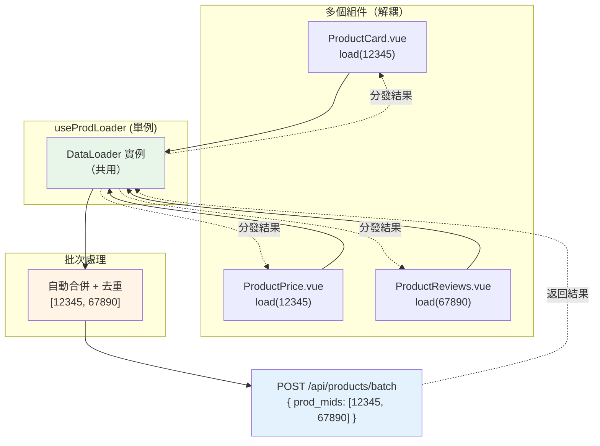
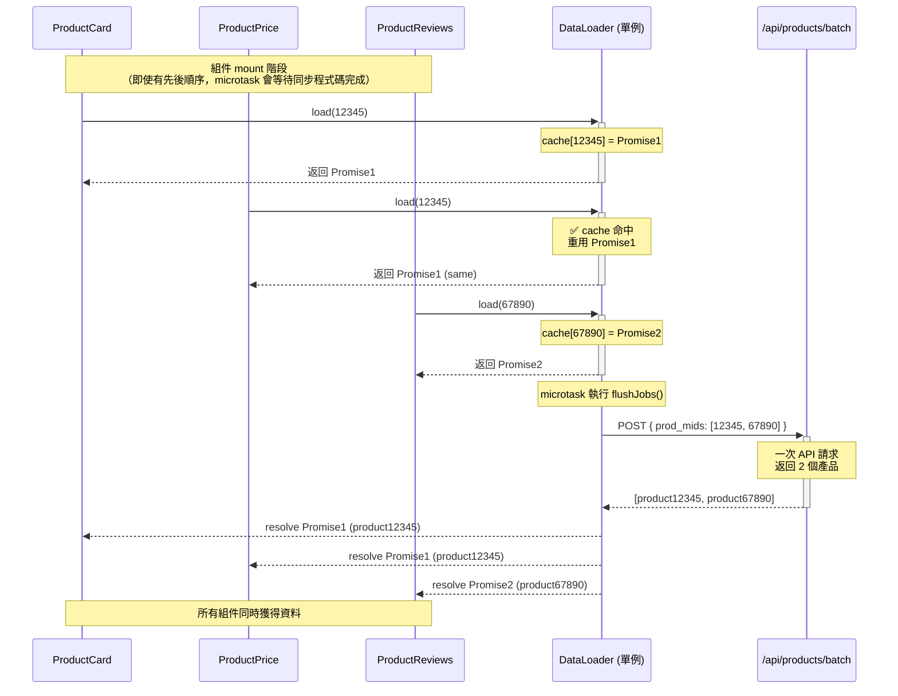
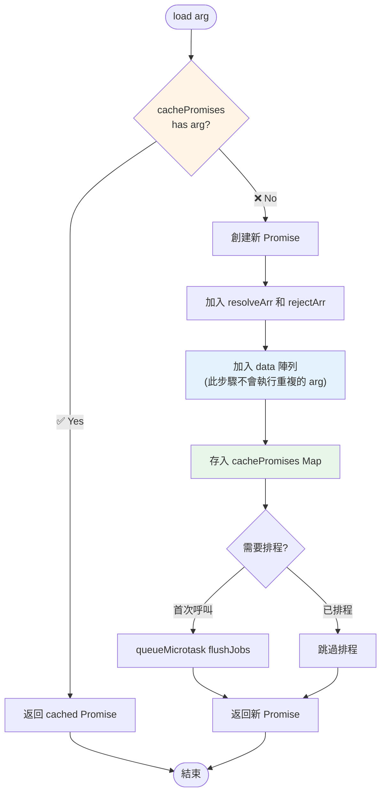
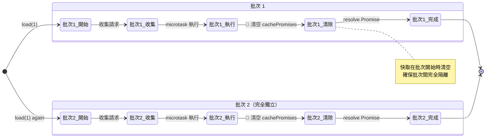
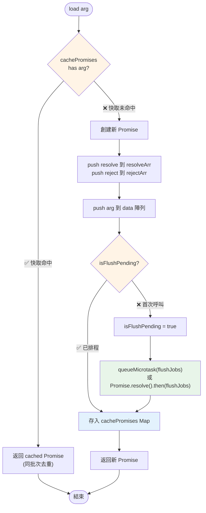
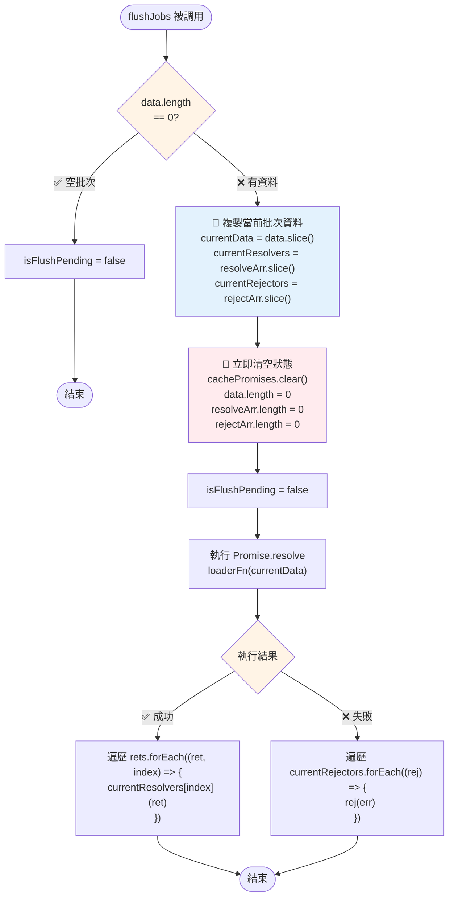

# DataLoader

一個輕量級的批次處理和去重工具，用於優化多個異步資料載入請求。

## 📋 目錄

- [簡介](#簡介)
- [核心概念](#核心概念)
- [快速開始](#快速開始)
- [⚠️ Nuxt SSR 使用注意事項](#️-nuxt-ssr-使用注意事項)
- [API 文件](#api-文件)
- [使用範例](#使用範例)
- [技術細節](#技術細節)
- [最佳實踐](#最佳實踐)
- [測試](#測試)

## 簡介

DataLoader 提供批次處理和去重功能，解決常見的 N+1 查詢問題。當你需要在短時間內多次請求相同或不同的資料時，DataLoader 會自動將這些請求合併為單次批次執行。

### ⭐ 主要使用情境

DataLoader 最常見的使用場景是：**多個組件共用同一個 DataLoader 實例**。

例如，在 KKday 專案中，當頁面上有多個商品相關組件（ProductCard、ProductPrice、ProductReviews 等）時：

- 每個組件可以獨立調用 `prodLoader.load(prod_mid)` 載入自己需要的產品資料
- DataLoader 會自動將這些請求合併為一次 API 調用
- 組件之間完全解耦，無需知道其他組件也在請求相同資料
- 避免了 N+1 查詢問題，大幅提升效能

**後端 Batch API**：

後端提供了批次查詢 API，需要收集多個 `prod_mid` 後一次查詢：

```typescript
// API Endpoint
POST /api/products/batch

// Request Body
{
  "prod_mids": [12345, 67890]  // 收集所有組件需要的產品 ID
}

// Response
{
  "products": [
    {
      "prod_mid": 12345,
      "name": "東京迪士尼樂園門票",
      "price": 2800,
      "description": "...",
      "review_count": 1543
    },
    {
      "prod_mid": 67890,
      "name": "大阪環球影城門票",
      "price": 2200,
      "description": "...",
      "review_count": 892
    }
  ]
}
```

DataLoader 會自動：

- 收集各組件請求的 `prod_mid`（如：12345, 12345, 67890）
- 去重後組成陣列（變成：[12345, 67890]）
- 發送一次 batch API 請求
- 將結果分發回各組件

**架構示意圖**：



**關鍵優勢**：

- ✅ **組件獨立性**：每個組件只關心自己需要的資料
- ✅ **自動優化**：無需手動協調，DataLoader 自動批次處理
- ✅ **效能提升**：多個請求合併為一次，減少網路開銷

### 核心優勢

- ✅ **批次處理**：自動合併同步執行的多個請求為單次批次
- ✅ **同批次去重**：相同參數的請求共享同一個 Promise
- ✅ **批次隔離**：不同批次間完全獨立，避免快取污染
- ✅ **類型安全**：完整的 TypeScript 泛型支援
- ✅ **零依賴**：純 TypeScript 實作，無外部套件依賴
- ✅ **輕量級**：核心程式碼僅 60 行

## 核心概念

### 1. 批次處理 (Batching)

將同一個 microtask 中的多個 `load()` 呼叫合併為單次執行：

```typescript
// 同步呼叫三次
const p1 = loader.load(1);
const p2 = loader.load(2);
const p3 = loader.load(3);

// 實際只執行一次 loaderFn([1, 2, 3])
```

**實際應用場景：多組件共用**

假設頁面上有 3 個商品組件需要載入產品資料：

```typescript
// ProductCard.vue
const product = await prodLoader.load(12345);

// ProductPrice.vue
const product = await prodLoader.load(12345);

// ProductReviews.vue
const product = await prodLoader.load(67890);
```

**執行時序圖**：



DataLoader 會自動：

1. 合併這 3 個請求為一次 API 調用
2. 去重相同的 `prod_mid`（12345 只請求一次）
3. 最終調用 `fetchProdMids([12345, 67890])`

**關鍵要點**：

- ProductCard 和 ProductPrice 請求相同的 `prod_mid: 12345`，但只發送一次請求
- 所有組件的 Promise 會在同一時間 resolve
- 組件之間完全不需要知道彼此的存在

### 2. 同批次去重 (Same-Batch Deduplication)

在同一批次中，相同參數的請求會重用同一個 Promise：

```typescript
const p1 = loader.load(1);
const p2 = loader.load(1); // 重用 p1 的 Promise
const p3 = loader.load(2);

// 實際傳入 loaderFn([1, 2])，而非 [1, 1, 2]
// p1 和 p2 是同一個 Promise instance
```

**去重流程圖**：



**重點**：

- ✅ `load(1)` 第一次調用時建立 Promise 並加入 data
- ✅ `load(1)` 第二次調用時直接返回 cached Promise，**不會**再次加入 data
- ✅ 最終 `data = [1, 2]` 而非 `[1, 1, 2]`

### 3. 批次隔離 (Batch Isolation)

不同批次間的快取完全隔離，避免跨批次的記憶體累積：

```typescript
// 批次 1
await loader.load(1); // 執行完成後快取被清空

// 批次 2（新的批次）
await loader.load(1); // 會建立新的 Promise 和新的批次
```

**批次隔離機制圖**：



**重點**：

- 🔑 每個批次執行時 `cachePromises.clear()` 會被調用
- ✅ 批次 1 的 `load(1)` 和批次 2 的 `load(1)` 是**不同的 Promise**
- ✅ 避免記憶體洩漏：快取不會跨批次累積

## 快速開始

### 基本使用

```typescript
import { Dataloader } from '@/utils/dataloder';

// 1. 定義批次載入函式
const batchLoadUsers = async (userIds: number[]) => {
  // 一次性載入多個使用者
  const users = await fetchUsersByIds(userIds);
  return users;
};

// 2. 建立 DataLoader 實例
const userLoader = new Dataloader(batchLoadUsers);

// 3. 使用 load() 方法載入資料
async function loadUserData() {
  // 這三個請求會自動合併為一次批次
  const user1 = await userLoader.load(1);
  const user2 = await userLoader.load(2);
  const user3 = await userLoader.load(3);

  console.log(user1, user2, user3);
}
```

### 實際應用場景

```typescript
// 場景：在列表中顯示多個產品的作者資訊
interface Product {
  id: number;
  authorId: number;
  name: string;
}

interface Author {
  id: number;
  name: string;
  avatar: string;
}

// 批次載入作者資料
const authorLoader = new Dataloader<number, Author>(async (authorIds) => {
  const response = await fetch('/api/authors', {
    method: 'POST',
    body: JSON.stringify({ ids: authorIds }),
  });
  return response.json();
});

// 在 Vue 元件中使用
async function loadProductsWithAuthors(products: Product[]) {
  // 所有 authorId 的請求會自動批次處理
  const productsWithAuthors = await Promise.all(
    products.map(async (product) => ({
      ...product,
      author: await authorLoader.load(product.authorId),
    })),
  );

  return productsWithAuthors;
}
```

## ⚠️ Nuxt SSR 使用注意事項

DataLoader 類本身完全支援 server-side 和 client-side 環境（使用標準的 `queueMicrotask`、`Promise`、`Map` 等 API），
但在 Nuxt SSR 中使用時，**絕對不能使用模組級別的 singleton**，否則會造成跨請求的資料污染。

### ❌ 錯誤範例（會造成資料洩露）

```typescript
// composables/useProdLoader.ts
import { Dataloader } from '@/utils/dataloder';

// ❌ 危險：這個變數會在 server-side 被所有使用者共用
let prodLoader: Dataloader<number, ProductData> | null = null;

export function useProdLoader() {
  if (!prodLoader) {
    prodLoader = new Dataloader(async (prodMids: number[]) => {
      const response = await fetch('/api/products/batch', {
        method: 'POST',
        headers: { 'Content-Type': 'application/json' },
        body: JSON.stringify({ prod_mids: prodMids }),
      });
      const data = await response.json();
      return prodMids.map((mid) => data.products.find((p) => p.prod_mid === mid));
    });
  }
  return {
    loadProduct: (prodMid: number) => prodLoader!.load(prodMid),
  };
}
```

**問題**：

- 在 **server-side**，這個 `prodLoader` 變數會被所有使用者請求共享
- **User A** 的產品資料可能被 **User B** 看到（跨請求 cache 污染）
- **嚴重的資料洩露和安全問題**

### ✅ 正確範例 1：使用 `useState`（推薦）

```typescript
// composables/useProdLoader.ts
import { Dataloader } from '@/utils/dataloder';

interface ProductData {
  prod_mid: number;
  name: string;
  price: number;
  description: string;
  review_count: number;
}

export function useProdLoader() {
  // ✅ useState 會為每個請求創建獨立的狀態
  const loader = useState(
    'prodLoader',
    () =>
      new Dataloader<number, ProductData>(async (prodMids: number[]) => {
        const response = await fetch('/api/products/batch', {
          method: 'POST',
          headers: { 'Content-Type': 'application/json' },
          body: JSON.stringify({ prod_mids: prodMids }),
        });
        const data = await response.json();
        return prodMids.map((mid) => data.products.find((p) => p.prod_mid === mid));
      }),
  );

  return {
    loadProduct: (prodMid: number) => loader.value.load(prodMid),
  };
}
```

**優點**：

- ✅ SSR 時為每個請求創建獨立的 DataLoader 實例
- ✅ Client-side 時持久化為響應式狀態
- ✅ 自動處理 hydration
- ✅ 在同一頁面內的多個組件仍共用同一個實例（效能最佳）

### ✅ 正確範例 2：Client-Only 使用

如果你的 DataLoader 只在客戶端使用（例如：僅在用戶互動後載入資料），可以明確限制為 client-only：

```typescript
// composables/useProdLoader.ts
import { Dataloader } from '@/utils/dataloder';

interface ProductData {
  prod_mid: number;
  name: string;
  price: number;
}

// ✅ 模組級別變數僅在 client-side 使用是安全的
let prodLoader: Dataloader<number, ProductData> | null = null;

export function useProdLoader() {
  // 僅在客戶端創建 singleton
  if (import.meta.client) {
    if (!prodLoader) {
      prodLoader = new Dataloader(async (prodMids: number[]) => {
        const response = await fetch('/api/products/batch', {
          method: 'POST',
          headers: { 'Content-Type': 'application/json' },
          body: JSON.stringify({ prod_mids: prodMids }),
        });
        const data = await response.json();
        return prodMids.map((mid) => data.products.find((p) => p.prod_mid === mid));
      });
    }
  }

  return {
    loadProduct: (prodMid: number) => {
      if (!import.meta.client) {
        throw new Error('useProdLoader 僅能在客戶端使用');
      }
      return prodLoader!.load(prodMid);
    },
  };
}
```

**適用場景**：

- ✅ 用戶互動後才載入的資料（如：點擊按鈕、滾動加載）
- ✅ 不影響 SEO 的非關鍵資料
- ❌ 不適合需要 SSR 渲染的初始頁面內容

### 選擇建議

| 使用場景                    | 推薦方案             | 原因                      |
| --------------------------- | -------------------- | ------------------------- |
| **需要 SSR 渲染的頁面內容** | 方案 1 (`useState`)  | 支援 SSR + 自動 hydration |
| **僅在用戶互動後載入**      | 方案 2 (Client-only) | 更簡單，效能更好          |
| **需要跨頁面持久化**        | 方案 1 (`useState`)  | 響應式狀態可持久化        |

## API 文件

### `Dataloader<T, R>`

泛型參數：

- `T`: 請求參數的類型（例如：`number`、`string`）
- `R`: 回傳結果的類型（例如：`User`、`Product`）

#### `constructor(loaderFn)`

建立 DataLoader 實例。

**參數**：

- `loaderFn: (args: T[]) => Promise<R[]> | R[]`
  - 批次載入函式，接收參數陣列，回傳結果陣列
  - 可以是同步或異步函式
  - **重要**：回傳結果的順序必須與輸入參數的順序一致

**範例**：

```typescript
// 異步 loaderFn
const loader1 = new Dataloader(async (ids: number[]) => {
  const users = await fetchUsers(ids);
  return users;
});

// 同步 loaderFn
const loader2 = new Dataloader((numbers: number[]) => {
  return numbers.map((n) => n * 2);
});
```

#### `load(arg: T): Promise<R>`

載入單一資料項目。

**參數**：

- `arg: T` - 要載入的資料識別符

**回傳**：

- `Promise<R>` - 包含載入結果的 Promise

**行為**：

- 如果在同一批次中已有相同參數的請求，回傳快取的 Promise
- 否則建立新的 Promise 並加入當前批次
- 第一次呼叫會觸發 microtask 排程

**範例**：

```typescript
const loader = new Dataloader(batchLoadFn);

// 單一請求
const result = await loader.load(1);

// 批次請求
const [r1, r2, r3] = await Promise.all([loader.load(1), loader.load(2), loader.load(3)]);

// 去重（p1 和 p2 是同一個 Promise）
const p1 = loader.load(1);
const p2 = loader.load(1);
console.log(p1 === p2); // true
```

## 使用範例

### 範例 1：基本使用

```typescript
import { Dataloader } from '@/utils/dataloder';

// 定義批次載入函式
const batchLoadFn = async (keys: number[]) => {
  console.log('批次載入:', keys);
  return keys.map((key) => key * 10);
};

const loader = new Dataloader(batchLoadFn);

// 同步呼叫多次
const p1 = loader.load(1);
const p2 = loader.load(2);
const p3 = loader.load(3);

// 等待結果
const results = await Promise.all([p1, p2, p3]);
console.log(results); // [10, 20, 30]
// 實際只執行一次: 批次載入: [1, 2, 3]
```

### 範例 2：去重機制

```typescript
const loader = new Dataloader(async (keys: number[]) => {
  console.log('載入:', keys);
  return keys.map((key) => ({ id: key, name: `User ${key}` }));
});

// 重複請求相同的 ID
const p1 = loader.load(1);
const p2 = loader.load(1);
const p3 = loader.load(2);

console.log(p1 === p2); // true - 同一個 Promise

const [user1, user2, user3] = await Promise.all([p1, p2, p3]);
// 實際只載入: [1, 2]
```

### 範例 3：錯誤處理

```typescript
const loader = new Dataloader(async (keys: number[]) => {
  if (keys.includes(-1)) {
    throw new Error('Invalid ID');
  }
  return keys.map((key) => key * 10);
});

try {
  // 批次中有錯誤會導致所有請求失敗
  await Promise.all([
    loader.load(1),
    loader.load(-1), // 會導致錯誤
    loader.load(2),
  ]);
} catch (error) {
  console.error('批次載入失敗:', error);
}
```

### 範例 4：批次隔離

```typescript
const loader = new Dataloader(async (keys: number[]) => {
  console.log('批次:', keys);
  return keys.map((key) => key * 10);
});

// 批次 1
await loader.load(1); // 輸出: 批次: [1]

// 批次 2（新的批次，快取已清空）
await loader.load(1); // 輸出: 批次: [1]

// 兩次是不同的請求
```

### 範例 5：在 Vue Composable 中使用

```typescript
// composables/useUserLoader.ts
import { Dataloader } from '@/utils/dataloder';

// 建立單例 loader
let userLoader: Dataloader<number, User> | null = null;

export function useUserLoader() {
  if (!userLoader) {
    userLoader = new Dataloader(async (userIds: number[]) => {
      const response = await fetch('/api/users/batch', {
        method: 'POST',
        body: JSON.stringify({ ids: userIds }),
      });
      return response.json();
    });
  }

  return {
    loadUser: (id: number) => userLoader!.load(id),
  };
}

// 在元件中使用
const { loadUser } = useUserLoader();

async function loadData() {
  const [user1, user2, user3] = await Promise.all([loadUser(1), loadUser(2), loadUser(3)]);
}
```

### 範例 6：不同類型的 Key

```typescript
// 使用字串作為 key
const stringLoader = new Dataloader<string, string>(async (keys) => {
  return keys.map((key) => `Result for ${key}`);
});

await stringLoader.load('user-123');
await stringLoader.load('product-456');

// 使用物件作為 key（需要注意物件引用）
interface QueryKey {
  type: string;
  id: number;
}

const objectLoader = new Dataloader<QueryKey, any>(async (keys) => {
  // 根據不同 type 批次查詢
  return keys.map((key) => fetchByType(key.type, key.id));
});
```

### 範例 7：多組件共用 DataLoader（⭐ 主要使用情境）

這是 DataLoader **最常見也最重要**的使用場景：多個組件共用同一個 DataLoader 實例。

#### 場景：商品頁面的多個組件

假設商品頁面有多個組件需要載入產品的 `prod_mid` 資料：

**步驟 1：建立共用的 DataLoader composable（SSR-safe 版本）**

```typescript
// composables/useProdLoader.ts
import { Dataloader } from '@/utils/dataloder';

interface ProductData {
  prod_mid: number;
  name: string;
  price: number;
  description: string;
  review_count: number;
}

export function useProdLoader() {
  // ✅ 使用 useState 確保 SSR 安全
  // SSR 時為每個請求創建獨立實例，Client-side 時持久化
  const loader = useState(
    'prodLoader',
    () =>
      new Dataloader<number, ProductData>(async (prodMids: number[]) => {
        console.log('📡 API 調用:', prodMids); // 觀察批次行為

        // 調用批次 API
        const response = await fetch('/api/products/batch', {
          method: 'POST',
          headers: { 'Content-Type': 'application/json' },
          body: JSON.stringify({ prod_mids: prodMids }),
        });
        const data = await response.json();

        // ⚠️ 重要：確保順序與 prodMids 一致
        return prodMids.map((mid) => data.products.find((p) => p.prod_mid === mid));
      }),
  );

  return {
    loadProduct: (prodMid: number) => loader.value.load(prodMid),
  };
}
```

> **注意**：此範例使用 `useState` 確保在 Nuxt SSR 環境中安全使用。詳見 [Nuxt SSR 使用注意事項](#️-nuxt-ssr-使用注意事項)。

**步驟 2：在各組件中獨立使用**

```vue
<!-- ProductCard.vue -->
<template>
  <div
    v-if="product"
    class="product-card"
  >
    <h3>{{ product.name }}</h3>
    <p>{{ product.description }}</p>
  </div>
</template>

<script setup>
const { loadProduct } = useProdLoader();
const { prodMid } = defineProps<{ prodMid: number }>();

const product = ref(null);

onMounted(async () => {
  console.log('ProductCard: loading', prodMid);
  product.value = await loadProduct(prodMid);
  console.log('ProductCard: loaded', prodMid);
});
</script>
```

```vue
<!-- ProductPrice.vue -->
<template>
  <div
    v-if="product"
    class="product-price"
  >
    <span class="price">${{ product.price }}</span>
  </div>
</template>

<script setup>
const { loadProduct } = useProdLoader();
const { prodMid } = defineProps<{ prodMid: number }>();

const product = ref(null);

onMounted(async () => {
  console.log('ProductPrice: loading', prodMid);
  product.value = await loadProduct(prodMid);
  console.log('ProductPrice: loaded', prodMid);
});
</script>
```

```vue
<!-- ProductReviews.vue -->
<template>
  <div
    v-if="product"
    class="product-reviews"
  >
    <p>評論數：{{ product.review_count }}</p>
  </div>
</template>

<script setup>
const { loadProduct } = useProdLoader();
const { prodMid } = defineProps<{ prodMid: number }>();

const product = ref(null);

onMounted(async () => {
  console.log('ProductReviews: loading', prodMid);
  product.value = await loadProduct(prodMid);
  console.log('ProductReviews: loaded', prodMid);
});
</script>
```

**步驟 3：在頁面中使用**

```vue
<!-- ProductPage.vue -->
<template>
  <div class="product-page">
    <ProductCard :prod-mid="12345" />
    <ProductPrice :prod-mid="12345" />
    <ProductReviews :prod-mid="67890" />
  </div>
</template>
```

**實際執行結果**：

Console 輸出：

```
ProductCard: loading 12345
ProductPrice: loading 12345
ProductReviews: loading 67890
📡 API 調用: [12345, 67890]  ← 只有一次！
ProductCard: loaded 12345
ProductPrice: loaded 12345
ProductReviews: loaded 67890
```

**執行分析**：

1. 3 個組件同時調用 `loadProduct()`
2. DataLoader 收集到 3 個請求：`[12345, 12345, 67890]`
3. 自動去重後變成：`[12345, 67890]`
4. 發送一次 API 請求，參數為 `[12345, 67890]`
5. 所有組件幾乎同時獲得資料

**優勢**：

- ✅ **組件解耦**：每個組件不需要知道其他組件的存在
- ✅ **自動優化**：無需手動協調，DataLoader 自動批次處理
- ✅ **程式碼簡潔**：每個組件只需要 `loadProduct(prodMid)` 一行
- ✅ **效能提升**：3 個請求合併為 1 個，減少網路開銷 **67%**
- ✅ **維護友善**：新增組件時無需修改現有程式碼

## 技術細節

### 批次處理機制

DataLoader 使用 `queueMicrotask`（或 `Promise.resolve().then()` 作為 fallback）來實現批次處理：

```typescript
// 第一次 load() 呼叫
if (!this.isFlushPending) {
  this.isFlushPending = true;
  queueMicrotask(this.flushJobs); // 排程批次執行
}

// 在當前 call stack 執行完後，microtask 被執行
// 此時收集到的所有 load() 呼叫會一次性處理
```

**load() 方法完整流程圖**：



**執行邏輯說明**：

1. **快取檢查**：首先檢查 `cachePromises` 是否已有該參數
2. **同批次去重**：如果有，直接返回 cached Promise（避免重複請求）
3. **建立請求**：如果沒有，創建新 Promise 並收集 resolve/reject callbacks
4. **排程決策**：檢查是否已經排程了 `flushJobs`
5. **首次排程**：如果是首次呼叫，使用 `queueMicrotask` 排程批次執行
6. **快取儲存**：將 Promise 存入 Map，供後續相同參數的請求使用

### 快取機制

使用 `Map<T, Promise<R>>` 實現同批次去重：

```typescript
// 檢查快取
if (this.cachePromises.has(arg)) {
  return this.cachePromises.get(arg)!; // 重用 Promise
}

// 建立新 Promise 並快取
const promise = new Promise<R>(...);
this.cachePromises.set(arg, promise);
```

### 批次隔離

每個批次執行時會清空快取，確保批次間獨立：

```typescript
private flushJobs() {
  // 複製當前批次資料
  const currentData = this.data.slice();
  const currentResolvers = this.resolveArr.slice();

  // 立即清空快取和資料
  this.cachePromises.clear(); // 🔑 關鍵：清空快取
  this.data.length = 0;
  this.resolveArr.length = 0;

  // 執行批次載入
  Promise.resolve(this.loaderFn(currentData)).then(...);
}
```

**flushJobs() 執行流程圖**：



**執行順序重點**：

1. **空批次檢查**：如果 `data.length === 0`，直接結束（避免無意義的執行）

2. **快照當前狀態** 📸：

   - 複製 `data`、`resolveArr`、`rejectArr` 到局部變數
   - 這些快照用於本次批次執行

3. **🔑 關鍵：立即清空狀態**（批次隔離的核心）：

   ```typescript
   this.cachePromises.clear(); // 清空快取 Map
   this.data.length = 0; // 清空參數陣列
   this.resolveArr.length = 0; // 清空 resolvers
   this.rejectArr.length = 0; // 清空 rejectors
   ```

   - ⚠️ **在 `loaderFn` 執行前**就清空，不是在 `finally` 中
   - ✅ 確保新的 `load()` 調用會進入下一個批次

4. **執行 loaderFn**：

   - 使用快照的 `currentData` 執行
   - 返回 Promise 結果

5. **處理結果**：
   - **成功**：逐一 resolve 對應的 Promise
   - **失敗**：全部 reject（整個批次失敗）

**為什麼在執行前清空？**

- 避免 Race Condition：如果在 `finally` 中清空，可能會誤清空下一個批次的資料
- 批次隔離：確保正在執行的批次和新收集的批次完全獨立

### 錯誤處理

批次載入失敗時，該批次中的所有請求都會被 reject：

```typescript
Promise.resolve(this.loaderFn(currentData))
  .then((rets) => {
    // 成功：逐一 resolve
    rets.forEach((ret, index) => {
      currentResolvers[index](ret);
    });
  })
  .catch((err) => {
    // 失敗：全部 reject
    currentRejectors.forEach((rej) => rej(err));
  });
```

## 最佳實踐

### ✅ 建議做法

1. **使用單例模式**

   避免為相同類型的資料建立多個 DataLoader 實例：

   ```typescript
   // ✅ 好的做法
   const userLoader = new Dataloader(batchLoadUsers);

   function useUserData() {
     return userLoader; // 重用同一個實例
   }

   // ❌ 不好的做法
   function useUserData() {
     return new Dataloader(batchLoadUsers); // 每次建立新實例
   }
   ```

   **為什麼必須使用單例？**

   多組件共用場景下，單例模式至關重要。以下對比圖展示差異：

   ```mermaid
   flowchart TB
       subgraph Wrong["❌ 錯誤：多實例"]
           direction TB
           W1["ProductCard.vue<br/>new Dataloader()"]
           W2["ProductPrice.vue<br/>new Dataloader()"]
           W3["ProductReviews.vue<br/>new Dataloader()"]

           W1 -->|"load(12345)"| WL1["Loader 1"]
           W2 -->|"load(12345)"| WL2["Loader 2"]
           W3 -->|"load(67890)"| WL3["Loader 3"]

           WL1 --> WAPI1["API 請求 1"]
           WL2 --> WAPI2["API 請求 2"]
           WL3 --> WAPI3["API 請求 3"]

           WAPI1 -.->|"❌"| WResult["3 次網路請求<br/>12345 重複請求"]
           WAPI2 -.->|"❌"| WResult
           WAPI3 -.->|"❌"| WResult
       end

       subgraph Right["✅ 正確：單例"]
           direction TB
           R1["ProductCard.vue"]
           R2["ProductPrice.vue"]
           R3["ProductReviews.vue"]

           R1 -->|"load(12345)"| RL["useProdLoader()<br/>共用 DataLoader"]
           R2 -->|"load(12345)"| RL
           R3 -->|"load(67890)"| RL

           RL -->|"批次 + 去重"| RAPI["API 請求 1"]

           RAPI -.->|"✅"| RResult["1 次網路請求<br/>[12345, 67890]"]
       end

       style Wrong fill:#ffebee
       style Right fill:#e8f5e9
       style WResult fill:#ffcdd2
       style RResult fill:#a5d6a7
   ```

   **程式碼對比**：

   ```typescript
   // ❌ 錯誤：每個組件創建新實例
   // ProductCard.vue
   const loader1 = new Dataloader(fetchProdMids);
   const product1 = await loader1.load(12345);

   // ProductPrice.vue
   const loader2 = new Dataloader(fetchProdMids);
   const product2 = await loader2.load(12345);

   // ProductReviews.vue
   const loader3 = new Dataloader(fetchProdMids);
   const product3 = await loader3.load(67890);

   // 結果：發送 3 次 API 請求 ❌
   // Request 1: [12345]
   // Request 2: [12345]  ← 重複！
   // Request 3: [67890]

   // ✅ 正確：共用同一個實例
   const { loadProduct } = useProdLoader(); // 單例

   // ProductCard.vue
   const product1 = await loadProduct(12345);

   // ProductPrice.vue
   const product2 = await loadProduct(12345);

   // ProductReviews.vue
   const product3 = await loadProduct(67890);

   // 結果：發送 1 次 API 請求 ✅
   // Request 1: [12345, 67890]
   ```

   **記憶口訣**：

   - 🔑 **一個資料類型，一個 DataLoader 實例**
   - 🔑 **使用 composable 確保單例**
   - 🔑 **永遠不要在組件內部 `new Dataloader()`**

2. **確保 loaderFn 回傳順序正確**

   回傳結果的順序必須與輸入參數順序一致：

   ```typescript
   // ✅ 正確
   const loader = new Dataloader(async (ids: number[]) => {
     const users = await fetchUsers(ids);
     // 確保順序與 ids 一致
     return ids.map((id) => users.find((u) => u.id === id));
   });

   // ❌ 錯誤（順序可能不一致）
   const loader = new Dataloader(async (ids: number[]) => {
     const users = await fetchUsers(ids);
     return users; // 順序可能與 ids 不同
   });
   ```

3. **適當的錯誤處理**

   單獨處理每個請求的錯誤：

   ```typescript
   const results = await Promise.allSettled([loader.load(1), loader.load(2), loader.load(3)]);

   results.forEach((result, index) => {
     if (result.status === 'fulfilled') {
       console.log(`請求 ${index + 1} 成功:`, result.value);
     } else {
       console.error(`請求 ${index + 1} 失敗:`, result.reason);
     }
   });
   ```

### ⚠️ 注意事項

1. **不適合跨批次快取**

   DataLoader 只保留同批次的快取，不適合需要長期快取的場景：

   ```typescript
   // 如果需要跨批次快取，考慮使用其他方案
   const cache = new Map();

   const loader = new Dataloader(async (ids: number[]) => {
     const uncachedIds = ids.filter((id) => !cache.has(id));
     const results = await fetchUsers(uncachedIds);

     results.forEach((user) => cache.set(user.id, user));

     return ids.map((id) => cache.get(id));
   });
   ```

2. **批次大小控制**

   如果批次可能很大，考慮在 loaderFn 中分批處理：

   ```typescript
   const loader = new Dataloader(async (ids: number[]) => {
     const chunkSize = 100;
     const results = [];

     for (let i = 0; i < ids.length; i += chunkSize) {
       const chunk = ids.slice(i, i + chunkSize);
       const chunkResults = await fetchUsers(chunk);
       results.push(...chunkResults);
     }

     return results;
   });
   ```

3. **非同步載入順序**

   批次在不同事件循環中會分開執行：

   ```typescript
   // 批次 1
   loader.load(1);

   await new Promise((resolve) => setTimeout(resolve, 100));

   // 批次 2（不會與批次 1 合併）
   loader.load(2);
   ```

## 測試

完整的測試套件包含 26 個測試案例，涵蓋所有核心功能。

### 執行測試

```bash
# 執行所有測試
pnpm test:unit apps/main/tests/utils/dataloder.test.ts

# 監聽模式
pnpm test:unit --watch apps/main/tests/utils/dataloder.test.ts
```

### 測試涵蓋範圍

- ✅ 基礎功能（3 tests）
- ✅ 批次處理機制（3 tests）
- ✅ 同批次快取去重（3 tests）
- ✅ 批次隔離（4 tests）
- ✅ 錯誤處理（3 tests）
- ✅ 非同步時序（3 tests）
- ✅ 邊界情況（6 tests）
- ✅ Fallback 機制（1 test）

### 測試範例

```typescript
import { describe, it, expect, vi } from 'vitest';
import { Dataloader } from '../../utils/dataloder';

describe('Dataloader', () => {
  it('應該將多個 load 呼叫合併為單次 loaderFn 呼叫', async () => {
    const batchLoadFn = vi.fn(async (keys: number[]) => {
      return keys.map((key) => key * 10);
    });

    const loader = new Dataloader(batchLoadFn);

    const p1 = loader.load(1);
    const p2 = loader.load(2);
    const p3 = loader.load(3);

    const results = await Promise.all([p1, p2, p3]);

    expect(results).toEqual([10, 20, 30]);
    expect(batchLoadFn).toHaveBeenCalledTimes(1);
    expect(batchLoadFn).toHaveBeenCalledWith([1, 2, 3]);
  });
});
```

## 效能考量

### 優點

- ✅ 減少網路請求次數（N 次 → 1 次）
- ✅ 降低伺服器負載
- ✅ 提升應用程式回應速度
- ✅ 記憶體使用效率（批次完成後釋放快取）

### 適用場景

- ✅ **多組件載入相同類型資料**（⭐ 主要使用情境）
  - 商品列表頁：多個 ProductCard 載入產品資料
  - 商品詳情頁：ProductCard、ProductPrice、ProductReviews 等組件共同載入
  - 使用者資訊：多個組件顯示作者/評論者資訊
  - **特點**：組件完全解耦，自動優化網路請求
- ✅ 列表資料關聯查詢（如：產品列表載入作者資訊）
- ✅ 圖形/樹狀結構資料載入
- ✅ GraphQL Resolver
- ✅ 微服務架構中的資料聚合

### 不適用場景

- ❌ 需要即時資料的場景（批次會有延遲）
- ❌ 需要長期快取的場景
- ❌ 單次大量資料查詢（無批次效益）

## 參考資料

- [Facebook GraphQL DataLoader](https://github.com/graphql/dataloader) - 原始概念來源
- [測試檔案](../tests/utils/dataloder.test.ts) - 完整的使用範例和測試案例
- [PR #1402](https://github.com/kkday-it/kkday-b2c-web/pull/1402) - 實作討論和設計決策

## License

內部專案使用

---

**維護者**: KKday B2C Web Team
**最後更新**: 2025-01-20
